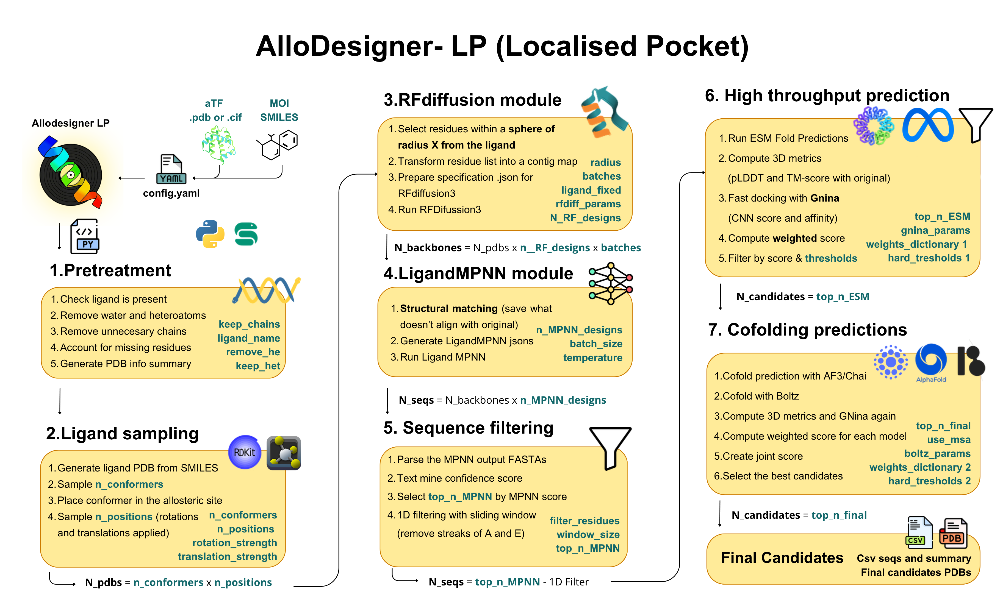

# Allodesigner LP + Snakemake

This folder contains the code for Allodesigner LP (Strategy 1) in its Snakemake implementation.




## Contents of the folder

| File | Description |
|------|-------------|
| [`bsd_def.smk`](#bsd_defsmk) | Main Snakemake workflow file — scatter-gather pipeline orchestration |
| [`functions_snakemake_bsd.py`](#functions_snakemake_bsdpy) | Refactored helper functions adapted for Snakemake execution |
| [`repair_pdb.py`](#repair_pdbpy) | Fixes PDB formatting issues in RFdiffusion outputs for LigandMPNN compatibility |
| [`ligand_sampling.py`](#ligand_samplingpy) | Ligand conformation sampling using RDKit |
| [`esm_high_throughput.py`](#esm_high_throughputpy) | High-throughput ESMFold structure prediction |
| [`basic_config_snakemake.yml`](#basic_config_snakemakeyml) | Template configuration file for pipeline parameters |
| [`sbatch_12jobs_2403.sh`](#sbatch_12jobs_2403sh) | SLURM batch submission script for HPC clusters (e.g. Berzelius) |
| [`visualisation_report.ipynb`](#visualisation_reportipynb) | Jupyter notebook for parsing Snakemake reports and visualizing metrics |

### `bsd_def.smk`
The main Snakemake workflow file containing all rules for orchestrating the scatter-gather parallel execution of the pipeline across LigandMPNN, ESMFold, Boltz, and CHAI/AF3 stages.

### `functions_snakemake_bsd.py`
Refactored Python functions specifically adapted for Snakemake. Contains execution logic, metrics calculations, parsing operations, and plotting functions used across pipeline rules.

### `repair_pdb.py`
Utility script to fix formatting issues in PDB files output by RFdiffusion, ensuring compatibility with downstream LigandMPNN processing.

### `ligand_sampling.py`
Performs ligand conformation sampling using RDKit to identify the lowest energy conformer state for downstream evaluations.

### `esm_high_throughput.py`
High-throughput script used by the pipeline to predict structures from sequences via the ESMFold model, processing large batches across available GPUs.

### `basic_config_snakemake.yml`
A template configuration file containing all parameters required for executing the pipeline — file paths, structural thresholds, and target definitions. See the [Configuration](#configuration) section for full documentation.

### `sbatch_12jobs_2403.sh`
A SLURM batch submission script tailored for running the pipeline on HPC clusters like Berzelius. See [Running the pipeline on Berzelius](#running-the-pipeline-on-berzelius) for details.

### `visualisation_report.ipynb`
A Jupyter notebook for parsing the Snakemake-generated reports, tracking performance metric distributions, and visualizing candidate outputs.

---

## Pipeline description

This Snakemake pipeline implements a binding site redesign workflow using RFdiffusion and LigandMPNN. The pipeline automates the process of:

1. **PDB Preparation** — cleaning and preparing PDB structures
2. **PDB Analysis** — extracting sequence, secondary structure, and defining active sites
3. **Ligand Sampling** — generating ligand conformers and exploring binding pocket positions
4. **Contig Map Generation** — defining protein regions for redesign
5. **RFdiffusion** — generating binding site redesigns (supports `all_atom`, `RF1`, or `RF3` models)
6. **LigandMPNN** — sequence design for redesigned structures
7. **Structure Prediction & Filtering** — high-throughput ESMFold, Boltz2, and AF3/Chai-1 predictions with cascaded filtering

---

## Pipeline Architecture

This Snakemake implementation handles thousands of design sequences rapidly through a **scatter-gather (MapReduce)** architecture. Computationally heavy GPU processes (LigandMPNN, ESMFold, Boltz, and AF3/CHAI) are parallelized via dynamic locking mechanisms across available GPUs.

```text
              [RF Diffusion Input PDBs]
                           │
   [generate_mpnn_jsons] & [repair_pdb_inputs]
                           │
                   [split_mpnn_jsons]
                           │ (scatter)
┌──────────────────────────┼──────────────────────────┐
[MPNN GPU 0]         [MPNN GPU 1]               [MPNN GPU N]
└──────────────────────────┼──────────────────────────┘
                           │ (gather)
           [process_mpnn_output_and_filter] (1D filter)
                           │
                    [split_esm_csv]
                           │ (scatter)
┌──────────────────────────┼──────────────────────────┐
[ESMFold GPU 0]      [ESMFold GPU 1]           [ESMFold GPU N]
└──────────────────────────┼──────────────────────────┘
                           │ (gather)
   [gather_esm_pdbs] & [sample_best_conformer]
                           │
                 [process_esm_batch]
                           │
     [first_3d_filter] (CHECKPOINT: 3D & GNINA filter)
                           │
      ┌────────────────────┼────────────────────┐ (scatter)
 [run_boltz]       [run_second_prediction] (CHAI/AF3)
      └────────────────────┼────────────────────┘ (gather)
                           │
              [gather_final_candidates]
                           │
       [plot_metric_distributions / report_validity]
```

---

## Pipeline Rules

### Phase 1 — LigandMPNN Scatter
**`generate_mpnn_jsons` & `repair_pdb_inputs`**: Parses the starting RFdiffusion structures, repairs PDB formatting, and constructs mapping JSONs indicating which residues LigandMPNN should redesign.

**`split_mpnn_jsons`**: Splits the MPNN configuration into N equal chunks based on available GPUs.

**`run_ligand_mpnn_hybrid`**: Executes LigandMPNN concurrently across available GPUs using file-locking (`acquire_pipeline_gpu`) to prevent memory collisions.

**`process_mpnn_output_and_filter`**: Gathers all predicted FASTA sequences, compiles a master DataFrame, and runs the 1D poly-alanine/poly-glutamate filter.

### Phase 2 — ESMFold Scatter
**`split_esm_csv` & `run_esmfold_hybrid`**: Splits the surviving 1D-filtered sequences into batches and pushes each batch to a GPU instance running an ESMFold Singularity/Apptainer container.

**`gather_esm_pdbs`**: Aggregates all predicted ESM PDB structures into a centralized directory.

### Phase 3 — First 3D Filter (Checkpoint)
**`sample_best_conformer`**: Prepares the lowest-energy ligand pose for docking evaluation.

**`split_esm_pdbs` & `process_esm_batch`**: Calculates structural parameters (RMSD, pLDDT, TM-score, steric clashes) and executes GNINA docking on the ESM predictions in parallel.

**`first_3d_filter` (Checkpoint)**: Evaluates combined batch metrics, applies the defined scoring weights, drops failures, and writes `ESM_survivors.csv`. Because it is a Snakemake checkpoint, the pipeline pauses, re-evaluates the DAG based on the exact number of survivors, and then resumes.

### Phase 4 & 5 — Second Prediction Scatter (Boltz / CHAI / AF3)
**`prep_boltz_yaml` & `run_boltz`**: Dynamically writes constraint YAMLs for the survivors and executes the Boltz2 model for combined structure and affinity prediction.

**`run_second_prediction`**: Runs the user's secondary model choice (AlphaFold3 or Chai-1) for both the unbound protein and the co-folded protein–ligand complex.

**`process_boltz_folder` & `process_second_prediction_folder`**: Standardizes file naming, reformatting nested model outputs to match the original `file_ID`.

### Phase 6 & 7 — Final Filtering and Visualization
**`gather_final_candidates`**: Extracts metrics and GNINA performance for all three prediction modalities (Boltz, regular fold, co-fold), validates co-folding centroid placement, and selects the top N globally scored candidate designs.

**`plot_plddt_vs_tmscore`, `plot_gnina`, `plot_metric_distributions`**: Leverages Snakemake's native reporting engine to generate KDE distributions and comparative scatter plots.

**`report_validity_and_candidates`**: Outputs the concluding text summary of the final validated sequences.

---

## Installation & Setup

### Requirements

- **Python 3.8+**
- **Snakemake 7.0+**
- **Conda/Mamba** (for environment management)
- **Required packages**: Biopython, NumPy, Pandas, PyMOL (for ligand detection), RDKit (for ligand handling), tmtools (for TM-align)

### External Tools

- **RFdiffusion All-Atom** (optional — for `all_atom` model)
- **RF1 or RF3** (optional — if using those models)
- **LigandMPNN** (optional — for sequence design)
- **ESMFold** (optional — for structure validation)

### Installation Steps

```bash
# 1. Clone or navigate to the pipeline directory
cd allosteric_biosensor_design_prediction/strategy_1_snakemake

# 2. Create conda environment
conda create -n rf_diffusion_bsd -c conda-forge snakemake python=3.10
conda activate rf_diffusion_bsd

# 3. Install dependencies
pip install -r requirements.txt
# OR manually:
pip install biopython numpy pandas rdkit pymol tmtools

# 4. Update the configuration file
nano config_rfdiffusion_bsd.yml
```

---

## Configuration

### Main Configuration File: `config_rfdiffusion_bsd.yml`

The pipeline is controlled by a YAML configuration file with the following sections:

#### 1. Basic Parameters
```yaml
structure_path: "path/to/input.pdb"          # Input structure
ligand_smiles: "CCO"                          # Target ligand SMILES
ligand_name: "Tc"                             # Ligand name in PDB
```

#### 2. Ligand Sampling Parameters
```yaml
num_conformers: 2                             # Number of conformers to generate
num_positions: 1                              # Number of sampling positions
conformer_rmsd_cutoff: 0.75                   # Conformer diversity threshold (Å)
rotation: 15                                  # Rotation angle (degrees)
translation: 0.3                              # Translation distance (Å)
```

#### 3. Active Site Definition
```yaml
first_shell_distance: 5.0                     # Distance to define first shell (Å)
second_shell_distance: 5.0                    # Distance to define second shell (Å)
include_second_shell: false                   # Include second shell in redesign
user_defined_active_site: null                # Override with [10, 15, 20]
user_defined_residues: null                   # Residues to force include [5, 8]
```

#### 4. Redesign Conditions
```yaml
RF_model: "all_atom"                          # Model: "all_atom", "RF1", or "RF3"
num_designs: 10                               # Number of designs to generate
T: 50                                         # Diffusion steps
conservative_redesign: false                  # Conserve secondary structure
segment_extension: 1                          # N/C extension from active site (residues)
n_termini_extension: 1                        # N-terminus extension
c_termini_extension: null                     # C-terminus extension
user_defined_contig_map: null                 # Override contig map
```

#### 5. RFdiffusion Parameters (if using all_atom model)
```yaml
path_to_RFAA_apptainer: "/path/to/rf_se3_diffusion.sif"
path_to_RFAA_script: "/path/to/run_inference.py"
path_to_RFAA_weights: "/path/to/RFDiffusionAA_paper_weights.pt"
RFAA_ligand_name: "UNL"                       # Ligand name in RF model
deterministic: true                           # Reproducible results
design_startnum: 1                            # Starting design number
```

#### 6. LigandMPNN Parameters
```yaml
path_to_ligand_MPNN_script: "/path/to/LigandMPNN/run.py"
path_to_ligand_MPNN_env: "/path/to/ligandmpnn_env"
MPNN_num_designs: 10                          # Sequences per structure
mpnn_temperature: 0.05                        # Sampling temperature
first_shell_only: false                       # Only redesign first shell
```

---

## Usage

### Basic Execution

```bash
# Dry run (check DAG without executing)
snakemake --snakefile bsd_def.smk \
  --configfile basic_config_snakemake.yml \
  -n

# Run pipeline with 1 job
snakemake --snakefile bsd_def.smk \
  --configfile basic_config_snakemake.yml \
  -c 1

# Run with 4 parallel jobs
snakemake --snakefile bsd_def.smk \
  --configfile basic_config_snakemake.yml \
  -c 4

# Run with verbose output
snakemake --snakefile bsd_def.smk \
  --configfile basic_config_snakemake.yml \
  -c 1 -p

# Generate DAG visualization
snakemake --snakefile bsd_def.smk \
  --configfile basic_config_snakemake.yml \
  --dag | dot -Tpng > dag.png
```

### Advanced Options

```bash
# Run a specific rule
snakemake --snakefile bsd_def.smk \
  --configfile basic_config_snakemake.yml \
  -c 1 run_rf_diffusion

# Print shell commands for debugging
snakemake --snakefile bsd_def.smk \
  --configfile basic_config_snakemake.yml \
  -c 1 --printshellcmds

# Force re-run of a specific rule
snakemake --snakefile bsd_def.smk \
  --configfile basic_config_snakemake.yml \
  -c 1 --forcerun run_rf_diffusion

# Use conda environments (if defined in rules)
snakemake --snakefile bsd_def.smk \
  --configfile basic_config_snakemake.yml \
  -c 1 --use-conda
```

---

## Output Structure

```
output_dir/
├── PDB_prep/
│   ├── cleaned_structure.pdb          # Cleaned input structure
│   └── clean_status.txt               # Status file
├── PDB_info/
│   ├── pdb_info.json                  # Extracted PDB information
│   └── contig_map.json                # RFdiffusion contig map
├── ligand_sampling/
│   ├── lowest_energy_conformer.pdb    # Best ligand conformer
│   └── conformer_list.json            # All generated conformers
└── RF_designs/
    ├── design_*.pdb                   # Individual RFdiffusion designs
    ├── scores.json                    # Design evaluation metrics
    └── designs_completed.txt          # Completion marker
```

---

## Running the pipeline on Berzelius

If running on an HPC cluster like Berzelius (managed by NSC via SLURM), the `sbatch_12jobs_2403.sh` wrapper script ensures the workflow properly acquires nodes, loads the relevant Singularity/Apptainer modules, and schedules background GPU instances efficiently.

The script is configured to:

**Acquire resources** — requests a compute node with multiple GPUs (e.g. NVIDIA A100s) for an allotted wall-time using standard SLURM `#SBATCH` directives.

**Set up the environment** — loads necessary modules (e.g. Anaconda3, Apptainer) and activates the `snakemake_env` Conda environment.

**Trigger Snakemake** — initiates the Snakemake orchestrator (`snakemake -s bsd_def.smk`) with the appropriate number of cores/GPUs (e.g. `--cores 12`) and output directory mapping.

By managing execution through Snakemake within the sbatch allocation, the pipeline internally parses the `CUDA_VISIBLE_DEVICES` granted by SLURM and safely distributes heavy folding operations (ESMFold, Boltz, AF3/CHAI) to distinct GPU devices without manual intervention.

```bash
sbatch sbatch_12jobs_2403.sh
```
