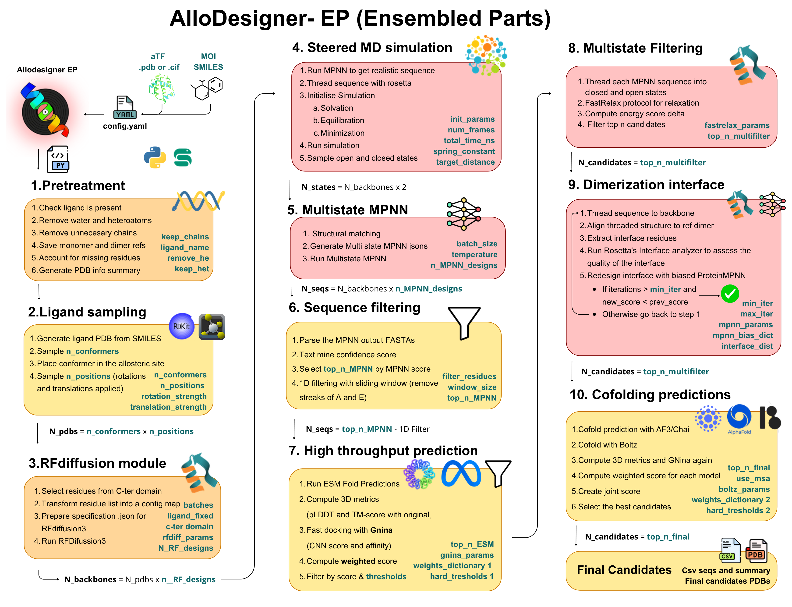

# Allodesigner EP

## Strategy description

This strategy implements a multistate design approach to allosteric biosensor engineering. Rather than relying on a single static conformation, this pipeline explores the dynamic conformational landscape of the sensor. It utilizes Steered Molecular Dynamics (SMD) and conformational relaxation to capture distinct active (ligand-bound) and inactive (unbound) structural states. Using Multistate LigandMPNN, sequences are designed to explicitly stabilize the intended conformations across these different states. The generated sequences are then threaded, folded using high-throughput prediction models, and aggressively filtered to ensure high-affinity target binding and proper allosteric switching upon ligand engagement.

---

## Contents of the folder

| File | Description |
|------|-------------|
| [`binding_site_designer_HTH.smk`](#binding_site_designer_hthsmk) | Main Snakemake workflow — orchestrates the multistate scatter-gather pipeline |
| [`functions_bsd_HTH.py`](#functions_bsd_hthpy) | Helper functions for execution logic, metric parsing, and structural calculations |
| [`steered_MD.py` & `prepare_steered_MD.py`](#steered_mdpy--prepare_steered_mdpy) | Initialize and execute Steered Molecular Dynamics to sample alternative protein states |
| [`seq_threading.py`](#seq_threadingpy) | Threads MPNN sequences onto alternative backbone states for stability evaluation |
| [`fastrelax.py`](#fastrelaxpy) | Executes structure relaxation to resolve clashes and minimize energy |
| [`dimerization_interface_generator.py`](#dimerization_interface_generatorpy) | Generates and analyzes multimeric interfaces for complex biosensors |
| [`repair_clean_pdb.py`](#repair_clean_pdbpy) | Cleans and standardizes input PDB formats for downstream compatibility |
| [`ligand_sampling.py`](#ligand_samplingpy) | Ligand conformation sampling using RDKit within the defined binding pocket |
| [`esm_high_throughput.py`](#esm_high_throughputpy) | Parallelized high-throughput sequence-to-structure prediction via ESMFold |

### `binding_site_designer_HTH.smk`
The main Snakemake workflow file containing all rules for orchestrating the multistate scatter-gather pipeline across LigandMPNN, ESMFold, sequence threading, Boltz2, and CHAI/AF3 stages.

### `functions_bsd_HTH.py`
Helper functions containing execution logic, metric parsing, and structural calculations used across pipeline rules.

### `steered_MD.py` & `prepare_steered_MD.py`
Scripts to initialize and execute Steered Molecular Dynamics (SMD) simulations, pulling the input structure into its alternative conformation to generate the secondary state required for multistate design.

### `seq_threading.py`
Threads newly generated MPNN sequences onto alternative backbone states to evaluate physical viability and estimate free energy differences between the active and inactive conformations.

### `fastrelax.py`
Executes FastRelax structure relaxation (via PyRosetta) to resolve clashes and minimize energy in predicted or sampled conformations.

### `dimerization_interface_generator.py`
Utility to generate and analyze multimeric (dimeric) interfaces, accounting for the homodimeric nature of HTH transcription factors during the redesign process.

### `repair_clean_pdb.py`
Cleans and standardizes input PDB formats for compatibility with LigandMPNN, PyRosetta, and other downstream structural tools.

### `ligand_sampling.py`
Performs ligand conformation sampling using RDKit to generate and position diverse low-energy conformers within the defined binding pocket.

### `esm_high_throughput.py`
High-throughput script for parallelized sequence-to-structure prediction using ESMFold, distributing batches across available GPU instances.

---

## Pipeline description

This Snakemake pipeline automates the generation and validation of multistate allosteric biosensors through the following sequence:

1. **Structure Preparation** — cleaning the input PDB and defining the initial structural state
2. **Conformational Sampling** — running Steered Molecular Dynamics to generate the target's alternative conformational state
3. **Multistate Sequence Design** — running Multistate LigandMPNN to generate sequences optimized for both active and inactive backbone conformations simultaneously
4. **High-Throughput Folding** — rapidly predicting 3D structures for the generated sequence libraries using ESMFold
5. **Sequence Threading** — threading sequences across different state backbones to evaluate folding energy and stability gaps
6. **Multistate Filtering** — applying a checkpoint filter to evaluate structural parameters, docking scores, and two-state compatibility
7. **Validation Predictions** — executing high-accuracy structural and affinity predictions using Boltz2 and secondary models (AlphaFold3/Chai-1)

---

## Pipeline Architecture

The pipeline uses a scatter-gather (MapReduce) architecture tailored for multistate design, distributing heavy computational steps across available GPU and CPU nodes to efficiently process large design libraries.

```text
             [Input Reference PDB]
                       │
       [clean_pdb] & [ligand_sampling]
                       │
            [initialize_steered_MD]
                       │
                 [steered_MD]
                       │
           [run_multistate_MPNN] (scatter)
                       │
    ┌──────────────────┴──────────────────┐
[MPNN GPU 0]                        [MPNN GPU N]
    └──────────────────┬──────────────────┘
                       │ (gather)
        [process_steered_MD_MPNN]
                       │
    ┌──────────────────┼──────────────────┐
[ESMFold] (scatter)            [seq_threading] (scatter)
    └──────────────────┬──────────────────┘
                       │ (gather)
          [generate_two_state_csv]
                       │
             [multistate_filter] (CHECKPOINT)
                       │
    ┌──────────────────┼──────────────────┐ (scatter)
[run_boltz]                [run_second_prediction]
    └──────────────────┼──────────────────┘ (gather)
                       │
           [gather_final_candidates]
                       │
           [plot_metric_distributions]
```

---

## Pipeline Rules

### Phase 1 — Preparation & Conformational Sampling
**`clean_pdb` & `ligand_sampling`**: Standardizes the starting structure and calculates optimal ligand starting positions.

**`initialize_steered_MD` & `steered_MD`**: Sets up constraints and pulls the protein structure into its alternative conformation to generate the secondary state required for multistate design.

### Phase 2 — Multistate Sequence Design
**`generate_mpnn_jsons` & `split_mpnn_jsons`**: Maps the target redesign residues and distributes tasks across available GPUs.

**`run_multistate_MPNN`**: Evaluates the input states simultaneously, generating sequences weighted to stably fold into both desired target states.

**`process_steered_MD_MPNN`**: Aggregates sequence outputs from all GPU instances.

### Phase 3 — Folding & Threading
**`run_esmfold_hybrid` & `gather_esm_pdbs`**: Scatters the sequence library across GPUs for rapid 3D structure prediction and aggregates the resulting PDB files.

**`threading_steered_MD` & `threading_for_multistate_filter`**: Threads generated sequences back onto the active/inactive backbones to evaluate physical viability and estimate free energy differences between states.

### Phase 4 — Multistate Checkpoint Filter
**`generate_two_state_csv`**: Compiles structural metrics (pLDDT, RMSD), threading energies, and docking metrics into a unified evaluation DataFrame.

**`multistate_filter` (Checkpoint)**: Applies strict thresholds requiring each design to successfully accommodate the ligand in State A while destabilizing or occluding the pocket in State B. Triggers a DAG recalculation for the surviving candidate pool.

### Phase 5 — Validation & Synthesis
**`prep_boltz_yaml`, `run_boltz`, & `run_second_prediction`**: Submits filtered candidates to Boltz2 and AlphaFold3/Chai-1 for final rigorous structural and affinity assessment.

**`gather_final_candidates` & `plot_metric_distributions`**: Analyzes multi-model consensus, extracts best-in-class biosensors, and plots the evaluation metric distributions.

---

## Installation & Setup

### Requirements

- **Python 3.8+**
- **Snakemake 7.0+**
- **Conda/Mamba** (for environment management)
- **Required packages**: Biopython, NumPy, Pandas, PyMOL, RDKit
- **PyRosetta** (required for SMD and FastRelax modules)

### External Tools

- **LigandMPNN** (specifically the multistate implementation)
- **ESMFold** (for high-throughput structure prediction)
- **Boltz2 / Chai-1 / AlphaFold3** (for validation)

### Installation Steps

```bash
# 1. Navigate to the pipeline directory
cd allosteric_biosensor_design_prediction/strategy_2

# 2. Create conda environment
conda create -n multistate_bsd -c conda-forge snakemake python=3.10
conda activate multistate_bsd

# 3. Install dependencies
pip install -r requirements.txt

# 4. Update the configuration file
nano config_multistate_bsd.yml
```

---

## Configuration

The pipeline is controlled by a YAML configuration file containing execution parameters, paths, and multistate thresholds.

#### 1. Target & Structural Parameters
```yaml
structure_path: "path/to/input.pdb"
ligand_smiles: "CCO"
ligand_name: "LIG"
gpus: 4
output_dir: "results_multistate"
```

#### 2. Steered MD Parameters
```yaml
smd_steps: 50000
spring_constant: 50.0
pulling_distance: 2.5
```

#### 3. Multistate MPNN Parameters
```yaml
path_to_ligand_MPNN_script: "/path/to/LigandMPNN/run.py"
path_to_ligand_MPNN_env: "/path/to/mpnn_env"
MPNN_num_designs: 25
mpnn_temperature: 0.1
state_weights: [0.5, 0.5]          # Weight distribution between state A and B
```

---

## Usage

### Basic Execution

```bash
# Dry run to verify the DAG without executing
snakemake --snakefile binding_site_designer_HTH.smk \
  --configfile config_multistate_bsd.yml \
  -n

# Execute across 4 parallel jobs/GPUs
snakemake --snakefile binding_site_designer_HTH.smk \
  --configfile config_multistate_bsd.yml \
  -c 4
```

### Advanced Options

```bash
# Force a specific rule to re-run
snakemake --snakefile binding_site_designer_HTH.smk \
  --configfile config_multistate_bsd.yml \
  -c 4 --forcerun multistate_filter

# Generate DAG visualization
snakemake --snakefile binding_site_designer_HTH.smk \
  --configfile config_multistate_bsd.yml \
  --dag | dot -Tpng > multistate_dag.png
```

---

## Output Structure

```
results_multistate/
├── PDB_prep/
│   ├── cleaned_input.pdb
│   └── ligand_conformers/
├── Steered_MD/
│   ├── state_A.pdb
│   ├── state_B_sampled.pdb
│   └── smd_trajectories/
├── MPNN_designs/
│   ├── multistate_generated_seqs.fasta
│   └── threaded_structures/
├── ESM_predictions/
│   ├── esm_batch_0/
│   └── esm_batch_N/
├── Filtering/
│   ├── two_state_evaluations.csv
│   └── multistate_survivors.csv
├── Validation_Models/
│   ├── boltz_outputs/
│   └── second_predictions/
└── Final_Reports/
    ├── candidate_summary.txt
    └── distribution_plots/
```
